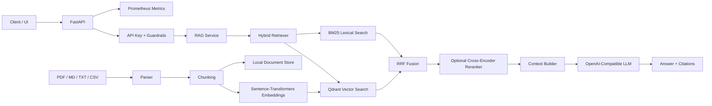

# Enterprise RAG Platform

A production-oriented Retrieval-Augmented Generation (RAG) reference platform for enterprise use cases.

This repository demonstrates an end-to-end RAG architecture with document ingestion, chunking, embeddings, vector retrieval, lexical retrieval, reciprocal-rank fusion, optional reranking, source citations, REST APIs, metrics, containerized local deployment, evaluation utilities, and CI/security checks.

> This is a portfolio/reference implementation. It uses synthetic sample data only and does not contain customer, company, credential, or internal-environment information.

## Why this project

Many RAG demos stop at "upload a PDF and ask a question." Enterprise deployments need more:

- repeatable ingestion and chunking
- retrieval quality controls
- source traceability
- configurable LLM backends
- observability and health checks
- API authentication
- offline/local deployment options
- evaluation before production rollout
- container and dependency security checks

## Architecture



## Features

### Ingestion
- PDF, Markdown, plain text and CSV
- configurable chunk size and overlap
- metadata preserved per chunk
- deterministic chunk identifiers

### Retrieval
- semantic vector retrieval with Qdrant
- BM25 lexical retrieval
- Reciprocal Rank Fusion (RRF)
- optional CrossEncoder reranking
- metadata/source filtering hooks

### Generation
- OpenAI-compatible chat completion API
- local Ollama is the default Docker example
- replaceable with OpenAI, Azure OpenAI, vLLM, LiteLLM or other compatible endpoints
- answers include numbered source citations
- prompt-injection heuristic guard

### Platform
- FastAPI REST API
- Docker / Docker Compose
- Prometheus metrics endpoint
- optional API-key authentication
- health/readiness endpoints
- structured application logging
- CI with lint/tests
- security workflow with pip-audit and Trivy

### Evaluation
- retrieval Recall@K
- Mean Reciprocal Rank (MRR)
- JSONL evaluation dataset format
- repeatable evaluation CLI

## Repository structure

```text
.
├── app/
│   ├── api/
│   ├── core/
│   ├── ingestion/
│   ├── rag/
│   └── retrieval/
├── data/
│   ├── eval/
│   └── sample/
├── docs/
├── scripts/
├── tests/
├── .github/workflows/
├── Dockerfile
├── docker-compose.yml
├── pyproject.toml
└── Makefile
```

## Quick start

### 1. Clone and configure

```bash
git clone https://github.com/kewinall/enterprise-rag-platform.git
cd enterprise-rag-platform
cp .env.example .env
```

### 2. Start services

```bash
docker compose up -d --build
```

Services:

| Service | Default URL |
|---|---|
| FastAPI | http://localhost:8000 |
| Swagger UI | http://localhost:8000/docs |
| Qdrant | http://localhost:6333 |
| Ollama | http://localhost:11434 |
| Metrics | http://localhost:8000/metrics |

### 3. Pull a local model

The model name is configurable in `.env`.

```bash
docker compose exec ollama ollama pull llama3.2:3b
```

### 4. Ingest the sample document

```bash
curl -X POST "http://localhost:8000/api/v1/ingest" \
  -H "X-API-Key: change-me" \
  -F "file=@data/sample/platform-handbook.md"
```

### 5. Ask a question

```bash
curl -X POST "http://localhost:8000/api/v1/query" \
  -H "Content-Type: application/json" \
  -H "X-API-Key: change-me" \
  -d '{
    "question": "What is the recommended production change process?",
    "top_k": 5
  }'
```

Example response shape:

```json
{
  "answer": "Production changes should be tested, reviewed, and released through a controlled deployment process [1].",
  "citations": [
    {
      "id": 1,
      "source": "platform-handbook.md",
      "chunk_id": "..."
    }
  ],
  "retrieval": {
    "candidates": 10,
    "used": 5
  }
}
```

## Local development

```bash
python -m venv .venv
source .venv/bin/activate
pip install -e ".[dev]"
cp .env.example .env
uvicorn app.main:app --reload
```

Run checks:

```bash
make lint
make test
```

## API endpoints

| Method | Endpoint | Purpose |
|---|---|---|
| GET | `/health` | liveness |
| GET | `/ready` | dependency readiness |
| GET | `/metrics` | Prometheus metrics |
| POST | `/api/v1/ingest` | ingest one file |
| POST | `/api/v1/search` | retrieval only |
| POST | `/api/v1/query` | RAG answer with citations |

## Configuration

Important environment variables are documented in `.env.example`.

Key options include:

- `QDRANT_URL`
- `QDRANT_COLLECTION`
- `EMBEDDING_MODEL`
- `RERANKER_MODEL`
- `ENABLE_RERANKER`
- `LLM_BASE_URL`
- `LLM_API_KEY`
- `LLM_MODEL`
- `RAG_API_KEY`
- `CHUNK_SIZE`
- `CHUNK_OVERLAP`

## Evaluation

```bash
python scripts/evaluate_retrieval.py \
  --dataset data/eval/retrieval_eval.jsonl \
  --k 5
```

See [docs/evaluation.md](docs/evaluation.md).

## Security notes

This project intentionally includes:
- API-key authentication option
- no secrets committed to source control
- prompt-injection heuristic screening
- dependency audit workflow
- Trivy filesystem scan
- explicit production-hardening guidance

The included controls are reference controls, not a substitute for enterprise IAM, network security, DLP, secret management or model governance.

See [docs/security.md](docs/security.md).

## Documentation

- [Architecture](docs/architecture.md)
- [Installation](docs/installation.md)
- [RAG design](docs/rag-design.md)
- [Evaluation](docs/evaluation.md)
- [Security](docs/security.md)
- [Troubleshooting](docs/troubleshooting.md)
- [Roadmap](docs/roadmap.md)

## Design principles

1. **Provider-neutral** — use an OpenAI-compatible LLM boundary instead of hard-coding one vendor.
2. **Retrieval-first** — retrieval can be tested independently from generation.
3. **Traceable** — every answer should preserve source/chunk lineage.
4. **Testable** — deterministic utilities are unit-tested without requiring a live LLM.
5. **Local-first** — Docker Compose can run the platform without sending enterprise documents to an external model.
6. **Production-aware** — configuration, metrics, security and evaluation are part of the design.

## License

MIT License. See [LICENSE](LICENSE).
